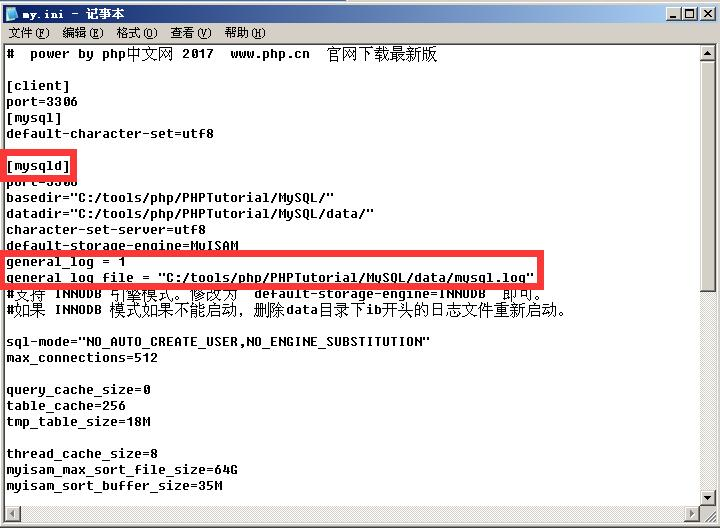
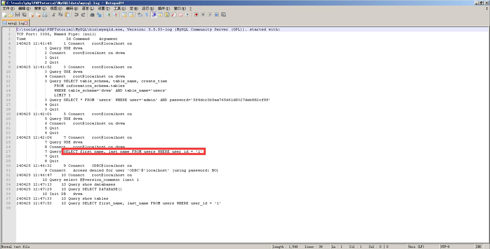

# SQL注入前言

* 前置知识
  * `Information_schema`数据库
  * `SQL`查询语法
* 靶场
  * `DVWA`
  * `sql-labs`
* 插件
  * `hackbar`
* 软件
  * `BurpSuite2024`

# Information_schema库

MySQL5.0以上，Mysql自带了Information_schema这个数据库，5.0以下是没有的。在MySQL中，把information_schema看作是一个数据库，确切说是信息数据库。其中保存着关于MySQL服务器所维护的所有其他数据库的信息。如数据库名，数据库的表，表栏的数据类型与访问权限等。

* **SCHEMATA表**：提供了当前`mysql`实例中所有数据库的信息。是`show databases`的结果取之此表。

  * `SCHEMA_NAME`	

    ​													**——该字段保存了所有的数据库名**

* **TABLES表**：提供了关于数据库中的表的信息（包括视图）。详细表述了某个表属于哪个schema，表类型，表引擎，创建时间等信息。是`show tables from schemaname`的结果取之此表。

  * `TABLE_NAME`

    ​													**——该字段保存了所有的表名**

  * `TABLE_SCHEMA`		        

    ​													**——该字段保存了该表来自哪个数据库**

* **COLUMNS表**：提供了表中的列信息。详细表述了某张表的所有列以及每个列的信息。是`show columns from schemaname.tablename`的结果取之此表。

  * `COLUMN_NAME`						

    ​													**——该字段保存了所有的字段名**

  * `TABLE_NAME`						   

    ​													**——该字段保存了该字段来自哪个数据表**

  * `TABLE_SCHEMA`						

    ​													**——该字段保存了该字段来自哪个数据库**

* STATISTICS表：提供了关于表索引的信息。是`show index from schemaname.tablename`的结果取之此表。

* USER_PRIVILEGES（用户权限）表：给出了关于全程权限的信息。该信息源自`mysql.user`授权表。是非标准表。

* SCHEMA_PRIVILEGES（方案权限）表：给出了关于方案（数据库）权限的信息。该信息来自`mysql.db`授权表。是非标准表。

* TABLE_PRIVILEGES（表权限）表：给出了关于表权限的信息。该信息源自`mysql.tables_priv`授权表。是非标准表。

* COLUMN_PRIVILEGES（列权限）表：给出了关于列权限的信息。该信息源自`mysql.columns_priv`授权表。是非标准表。

* CHARACTER_SETS（字符集）表：提供了`mysql`实例可用字符集的信息。是`SHOW CHARACTER SET`结果集取之此表。

* COLLATIONS表：提供了关于各字符集的对照信息。

* COLLATION_CHARACTER_SET_APPLICABILITY表：指明了可用于校对的字符集。这些列等效于`SHOW COLLATION`的前两个显示字段。

* TABLE_CONSTRAINTS表：描述了存在约束的表。以及表的约束类型。

* KEY_COLUMN_USAGE表：描述了具有约束的键列。

* ROUTINES表：提供了关于存储子程序（存储程序和函数）的信息。此时，ROUTINES表不包含自定义函数（UDF）。名为`mysql.procname`的列指明了对应于`INFORMATION_SCHEMA.ROUTINES`表的`mysql.proc`表列。

* VIEWS表：给出了关于数据库中的视图的信息。需要有`show views`权限，否则无法查看视图信息。

* TRIGGERS表：提供了关于触发程序的信息。必须有`super`权限才能查看该表

# 开启MySQL日志功能

为更方便理解sql注入，建议开启MySQL日志记录功能。开启后，会记录后端程序所执行的SQL语句。

开启方法：打开my.ini文件（和data文件夹同一个目录。如果是使用phpstudy的，可以通过phpstudy直接打开）

打开后再[mysqld]下增加两行,"general_log_file"的值修改为你的data文件夹路径

```
general_log = 1
general_log_file = "D:/phpStudy1/PHPTutorial/MySQL/data/mysql.log"
```

如图：



然后打开日志文件，就可以看到后端程序所执行的SQL语句了。



# ASCII码

为方便查询，故在此处放置一张ASCII码表。


# SQL注入

SQL是操作数据库数据的结构化查询语言，网页的应用数据和后台数据库中的数据进行交互时会采用SQL。而SQL注入是将Web页面的原URL、表单域或数据包输入的参数，修改拼接成SQL语句，传递给Web服务器，进而传给数据库服务器以执行数据库命令。如Web应用程序的开发人员对用户所输入的数据或cookie等内容不进行过滤或验证(即存在注入点)就直接传输给数据库，就可能导致拼接的SQL被执行，获取对数据库的信息以及提权，发生SQL注入攻击，它目前是黑客对数据库进行攻击的最常用手段之一。

## 危害

攻击者通过SQL注入获取到服务器的库名、表名、字段名，从而获取到整个服务器中的数据，对网站用户的数据安全有极大的威胁。攻击者也可以通过获取到的数据，得到后台管理员的密码，然后对网页页面进行恶意篡改。这样不仅对数据库信息安全造成严重威胁，对整个数据库系统安全也影响重大。

## 原理

SQL注入攻击是通过操作输入来修改SQL语句，用以达到执行代码对WEB服务器进行攻击的方法。简单的说就是在post/get表单或页面请求的查询字符串中插入SQL语句，最终使web服务器执行恶意命令的过程。

## 分类

* **按注入位置分类**

  * GET注入
  * POST注入
  * Head头注入

* **按结果反馈分类**

  * 有回显注入（显错注入）
  * 无回显注入（盲注）

* **按数据类型分类**

  * 字符型注入：当输入参数为字符串时，称为字符型。

    字符型：'柯基'	'C0rgi'	'1'

  * 数字型注入：当输入的参数为整型时，如ID、年龄、页码等，如果存在注入漏洞，则可以认为是数字型注入。

    数字型只有：0	1	2	3	4	5	6	7	8	9

  数字型与字符型注入最大的区别在于：数字型不需要单引号闭合，而字符串类型一般要使用单引号来闭合。

## 过程

1. SQL注入点探测。探测SQL注入点是关键的一步，通过适当的分析应用程序，可以判断什么地方存在SQL注入点。通常只要带有输入提交的动态网页，并且动态网页访问数据库，就可能存在SQL注入漏洞。如果程序员信息安全意识不强，采用动态构造SQL语句访问数据库，并且对用户的输入未进行有效性验证，则存在SQL注入漏洞的可能性很大。一般通过页面的报错信息来确定是否存在SQL注入漏洞。
2. 收集后台数据库信息。不同数据库的注入方法、函数都不尽相同，因此在注入之前，我们先要判断一下数据库的类型。判断数据库类型的方法很多，可以输入特殊字符，如单引号，让程序返回错误信息，我们根据错误信息提示进行判断；还可以使用特定函数来判断，比如输入`selectversion()`，程序返回正常，说明`version()`函数被数据库识别并执行，而`version()`函数是MySQL特有的函数，因此可以推断后台数据库为MySQL。
3. 猜解用户名和密码。数据库中的表和字段命名一般都是有规律的。通过构造特殊SQL语句在数据库中依次猜解出表名、字段名、字段数、用户名和密码。
4. 查找Web后台管理入口。WEB后台管理通常不对普通用户开放，要找到后台管理的登录网址，可以利用Web目录扫描工具（如：`wwwscan`、`AWVS`）快速搜索到可能的登录地址，然后逐一尝试，便可以找到后台管理平台的登录网址。
5. 入侵和破坏。一般后台管理具有较高权限和较多的功能，使用前面已破译的用户名、密码成功登录后台管理平台后，就可以任意进行破坏，比如上传木马、篡改网页、修改和窃取信息等，还可以进一步提权，入侵Web服务器和数据库服务器。